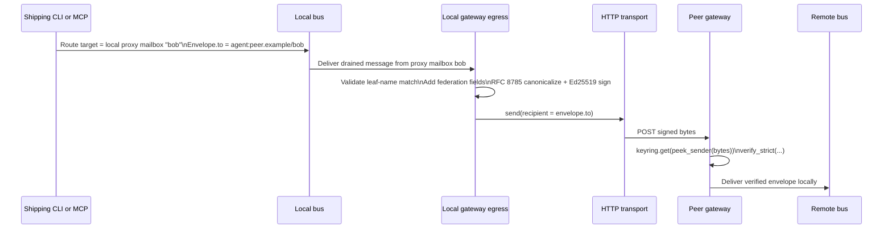

# FAMP v1.0 Remote Addressing Design Review

## Executive summary

The blocker is real as described in the brief: the shipping gateway path is valid and CI-proven, but the only user-facing send surface still emits `to = agent:local.bus/<name>` and an `audit_log` class, while gateway egress routes by the envelope’s own `to` principal and the HTTP transport only knows exact fully qualified peer principals such as `agent:<peer-domain>/bob`. In the documented two-machine flow, that deterministically ends in `UnknownRecipient` and zero cross-host delivery. Even if delivery somehow occurred, the `audit_log` stub still would not drive the task FSM, so the current setup guide’s terminal-state success criterion is unreachable through shipping tools. fileciteturn0file0L39-L45 fileciteturn0file0L48-L67 fileciteturn0file0L69-L119

My recommendation is **not C1, not C3 now, and not C4**. The best fix for the v1.0 blocker is **C2, refined into an explicit split-addressing model**:

- the user-facing CLI/MCP surface must let the sender specify the **remote principal** explicitly, either as `--to agent:<domain>/<name>` or as `--to <name> --domain <domain>`;
- the local bus send must target the **local gateway proxy mailbox** separately from the envelope’s `to`;
- gateway egress should continue to route by the envelope’s signed `to`, but it should also validate that the drained proxy mailbox name matches the destination principal’s leaf name before signing and dispatching.

That is the smallest *acceptable* change that restores a shipping end-to-end path while preserving addressing truthfulness, signature invariants, and the already-passing E2E semantics. The passing E2E strongly suggests that the low-level bus path already supports this split, because it injects hand-built domain-qualified envelopes through a raw bus client rather than through the shipping CLI stub. fileciteturn0file0L123-L128 fileciteturn0file0L164-L169

The release decision is therefore two-part. **Do not ship v1.0.0 in its current state with only a documentation caveat.** The current user-facing happy path is non-functional and directly contradicts the gate’s purpose. But **do not delay until C3 either**. Land C2-plus-docs-plus-tests, then ship **v1.0.0 with a documented limitation**: remote sends from shipping tools are signed and routable, but they remain `audit_log` fire-and-forget messages and do **not** yet expose the full Request/Deliver task-FSM path. C3 should be the first post-1.0 protocol-surface enhancement, not the release blocker. fileciteturn0file0L141-L145 fileciteturn0file0L171-L176

One caveat: the brief itself says the independent source-read control from `zed` is still pending. This report assumes the brief’s source-derived diagnosis is correct and treats that control as a required pre-merge confirmation, not as a reason to defer the design decision. fileciteturn0file0L132-L137

## Extracted constraints and candidate fixes

Section 6 of the brief imposes six hard constraints. In condensed form: cross-host messages must remain signed over a canonical RFC 8785 JSON representation with the `FAMP-sig-v1\0` domain-separation prefix; the local bus must remain unsigned unless the project explicitly reopens that settled v0.9 decision; the existing cross-host E2E is the behavioral ground truth and must remain green; v0.5.2 is the spec authority with any deviation documented; CI gates must not be weakened; and the receiver’s pinned-key lookup under the sender principal must remain coherent with the `from`/`to` pair the receiver actually sees. RFC 8785 exists precisely to make canonical signed JSON invariant under reserialization, and Ed25519 verification rejects mismatches when the signed bytes no longer match the verified bytes; `verify_strict` also adds anti-malleability checks beyond the minimal RFC acceptance path. fileciteturn0file0L183-L199 citeturn0search0turn2search0turn1search3

The candidate fixes in the brief separate cleanly into one expedient but semantically dangerous gateway-side rewrite, one sender-side addressing correction, one full restoration of the intended typed protocol path, and one family of proxy-binding route hacks. C1 rewrites `local.bus` recipients in egress under narrow single-peer/single-name conditions; C2 teaches the sender to emit a domain-qualified remote target while leaving egress untouched; C3 restores the real typed Request/Deliver flow promised by the stub comment; and C4 routes by proxy binding rather than by the signed `to` principal. fileciteturn0file0L151-L181

The architectural issue is easiest to see if the user-visible and gateway-visible destinations are separated explicitly:

That model matches the brief’s description of the passing hand-built E2E more naturally than any gateway rewrite. fileciteturn0file0L69-L106 fileciteturn0file0L123-L128

## Candidate evaluation

The matrix below scores each candidate against the brief’s facts and §6 constraints. Statuses are my analysis, based on the implementation behavior described in §§2, 5, and 6 of the brief and on the official signing/canonicalization sources. fileciteturn0file0L48-L119 fileciteturn0file0L151-L199 citeturn0search0turn1search3turn2search0

| Candidate | Signing invariant | Local bus unsigned | Existing E2E stays green | Spec fidelity risk | `from`/`to` provenance | Overall constraint compliance | Complexity | Risk | Performance impact | Compatibility | Dev ergonomics | Estimated effort |
|---|---|---:|---:|---|---|---|---|---|---|---|---|---|
| **C1: egress rewrites `to`** | ◐ Can be made cryptographically valid if rewrite happens before signing | ✅ | ✅ if already-domained envelopes remain untouched | ◐ Likely spec diff: hidden gateway canonicalization of recipient intent | ❌ Receiver sees a `to` the sender never authored | **Weak** | Low | Medium | Negligible | High wire compatibility, but semantic surprise | Superficially easy, operationally confusing | ~0.5–1.5 eng-days |
| **C2: sender emits domain-qualified `to`** | ✅ No post-hoc signed-field rewrite | ✅ | ✅ | ✅ Closest to existing E2E behavior | ✅ Sender-authored `to` is what receiver sees | **Strong** | Low–Medium | Low | Negligible | Strong backward compatibility if unqualified local sends remain valid | Good, especially with `--domain` sugar and full-principal support | ~1–3 eng-days |
| **C3: restore full Request/Deliver path** | ◐ Potentially full, but design boundary must be re-decided | ◐ Reopens settled unsigned-local-bus decision unless carefully constrained | ◐ Should remain possible, but much broader regression surface | ✅ Likely best long-term spec alignment | ✅ if designed cleanly | **Good long-term, high short-term scope risk** | High | High | Moderate, due more protocol work and FSM activity | Potentially breaking or at least broadening CLI/MCP semantics | Best eventual UX, worst blocker-fit | ~1–2+ weeks |
| **C4: route by proxy binding** | ◐ Routing no longer follows signed `to` semantics | ✅ | ✅/◐ Depends on exact implementation | ❌ Hidden routing policy diverges from envelope semantics | ❌ Signed destination and actual route can diverge | **Poor** | Low–Medium | Medium–High | Negligible | Opaque behavior in multi-peer or multi-name setups | Bad: “it goes where the gateway decides” | ~1–2 eng-days |
| **C5: split-addressing C2+ with proxy-name validation** | ✅ | ✅ | ✅ | ✅ | ✅ | **Best** | Medium | Low | Negligible | Strong | Best practical UX for v1.0 | ~2–4 eng-days |

**C1.** The attraction is obvious: it is the smallest textual diff and would allow `famp send --to bob` to start producing network traffic. But it creates an addressing lie exactly at the trust boundary. The receiver would verify and observe a `to` principal that the user-facing sender never authored, because gateway egress would substitute the remote authority just before signing. That is not a canonicalization break in the narrow RFC 8785 sense—mutation *before* signing is legal—but it is a provenance break in the system sense, because the signed statement is no longer the sender’s statement. In a single-peer/single-name topology that may be operationally tolerable; in a federated protocol, it is the wrong invariant to normalize. It also does nothing about the `audit_log`/FSM gap. fileciteturn0file0L153-L162 fileciteturn0file0L185-L199 citeturn0search0turn1search3

**C2.** This is the cleanest blocker fix because it changes the user-facing statement rather than hiding a gateway repair. The sender now authors the correct remote destination, egress does not need to reinterpret intent, transport already knows how to route exact fully qualified principals, and the trusted bytes seen by the receiver correspond to what the client meant to send. The brief’s existing E2E strongly implies the last missing piece is only exposing the low-level “bus target is local proxy; envelope recipient is remote principal” split at the shipping CLI/MCP layer. Its weakness is not technical but product-facing: it still leaves `famp send` as an `audit_log` stub, so the setup guide’s terminal-state promise has to be withdrawn or deferred. fileciteturn0file0L164-L169 fileciteturn0file0L83-L106 fileciteturn0file0L123-L128

**C3.** This is the only candidate that actually fulfills the setup guide’s current end-to-end task-FSM criterion, because it restores the typed Request/Commit/Deliver/Ack path that the passing E2E already exercises. That makes it the right *destination architecture*. It is not the right v1.0 blocker fix. The brief explicitly says C3 forces a decision about signing on the local bus path versus only at the gateway boundary, and reopening the unsigned-local-bus decision is itself a scope expansion against a hard constraint. In other words: C3 is strategically correct, but tactically wrong for an urgent release blocker whose immediate defect is “no shipping client can address a remote principal.” fileciteturn0file0L171-L176 fileciteturn0file0L190-L192

**C4.** Routing by “which proxy mailbox drained this” instead of by the envelope’s `to` moves the system farther away from protocol truth. If the gateway routes everything from proxy `bob` to peer P regardless of the signed `to`, then either the receiver sees a destination that no longer explains why the message arrived where it did, or the gateway has to rewrite `to` anyway and lands back in C1’s provenance problem. This is attractive only if one assumes the local proxy binding is the true identity and the signed `to` is merely advisory. The brief’s current transport and E2E both point the other way. fileciteturn0file0L69-L106 fileciteturn0file0L178-L181

**C5.** The superior variant is really **C2 made explicit**: remote addressing belongs in the sender surface, but because the local gateway proxy is an implementation detail, the CLI/MCP surface should carry both concepts internally—*remote signed recipient* and *local bus route target*—without exposing the split unless needed. Add one egress validation that the drained proxy mailbox leaf name equals the recipient leaf name. That preserves integrity without introducing hidden address rewriting. This is the candidate I recommend.

## Recommended fix and invariant analysis

The recommended implementation is:

1. extend `famp send` and `famp_send` to accept either a full principal (`agent:<domain>/<name>`) or a simple name plus `--domain <domain>`;
2. when remote addressing is selected, construct the envelope with `to = agent:<domain>/<name>`;
3. send that envelope to the **local proxy mailbox** for `<name>` using the same low-level split that the hand-built E2E already relies on;
4. keep gateway egress routing logic unchanged except for one validation: if the drained mailbox is for proxy name `n`, reject any envelope whose signed `to` leaf name is not `n`;
5. leave `audit_log` behavior unchanged for v1.0.0 and document it as a limitation;
6. schedule C3 as the follow-on feature to restore typed Request/Deliver/FSM semantics. fileciteturn0file0L123-L128 fileciteturn0file0L164-L169

The key invariants are straightforward to formalize.

**Invariant A: signed-recipient truthfulness.**  
For every cross-host envelope `E` emitted by shipping tools, the recipient principal carried inside `E.to` is exactly the remote principal intended by the sender, and transport selection uses that same principal. Under C2+, the sender writes `E.to = agent:d/n`; gateway egress does not rewrite `to`; transport lookup uses `msg.recipient = E.to`; the receiver verifies the same bytes and sees the same `to`. Therefore the principal used for routing, the principal signed, and the principal observed after verification are identical. C1 and C4 both fail this invariant because they allow routing truth to live somewhere other than the sender-authored signed `to`. fileciteturn0file0L73-L77 fileciteturn0file0L86-L99 fileciteturn0file0L153-L181

**Invariant B: pre-sign mutation only.**  
All envelope mutations that affect the signed bytes must occur before canonicalization and signing, and no component may modify a signed field afterwards. RFC 8785’s whole purpose is to make signing deterministic over a canonical representation; verification only succeeds when the verifier reconstructs and checks the same signed content. C2+ is strong here because there is no gateway-side address rewrite at all. The only data added at egress are the federation fields the current design already inserts before signing. That preserves the brief’s INV-10 requirement directly. fileciteturn0file0L185-L189 citeturn0search0turn2search0turn1search3

**Invariant C: local-bus policy isolation.**  
The local bus remains unsigned and unchanged as a trust domain boundary; the federation trust boundary stays at gateway egress. The sender’s local bus send may carry a remote principal inside the envelope, but the cryptographic transition still occurs only when the gateway drains, adds federation fields, canonicalizes, and signs. C2+ therefore preserves the settled v0.9 decision that same-host broker traffic is unsigned. C3 does not necessarily violate this, but it forces the project to decide whether the restored typed envelopes should also become locally signed, which is exactly why it is poor blocker scope. fileciteturn0file0L20-L29 fileciteturn0file0L190-L192

**Invariant D: E2E path continuity.**  
Any fix must preserve the already-passing E2E. C2+ does so because it aims to make the shipping CLI/MCP produce the same class of address-shaped inputs the E2E already hand-builds: a domain-qualified `to` delivered through a low-level bus client. Egress, transport, signature verification, and peer delivery remain unchanged. C1 and C4 preserve the E2E only by adding special cases around it; C2+ preserves it by converging the shipping surface toward it. fileciteturn0file0L123-L128 fileciteturn0file0L193-L195

**Invariant E: provenance-key coherence.**  
The receiver must perform key lookup under the same sender principal that the verified bytes advertise. The brief says `verify_inbound_any` uses `keyring.get(peek_sender(bytes))`, and egress currently leaves `from` untouched. C2+ does not change that relationship. I would not expand the v1.0 blocker scope to rework sender principal qualification unless the pending independent control finds evidence that `from = agent:local.bus/<identity>` is itself incompatible with current pinning practice. On the facts provided, the immediate blocker is `to` addressability, and the fix should stay there. fileciteturn0file0L196-L199 fileciteturn0file0L51-L52

Under normal operation, these invariants imply both safety and liveness for the blocker use-case. Safety: no peer receives an envelope whose signed destination was fabricated by the gateway, and no signature-valid envelope is rerouted to a different principal than the one in its own signed bytes. Liveness: if the sender provides a configured remote domain/name pair and the local proxy exists, the message reaches a peer URL already supported by the current transport map construction. The exact-match lookup that currently causes `UnknownRecipient` becomes the mechanism that succeeds. fileciteturn0file0L83-L106 fileciteturn0file0L108-L119

## Shipping decision and implementation plan

The decision memo is short.

**Decision.** Delay the tag **briefly** to implement C2+ and the associated docs/tests. Do **not** ship the current artifact with only a documented limitation, because the current documented happy path is known-bad and the bug is in the only shipping user surface. After C2+ lands, ship **v1.0.0** with the explicit limitation that shipping CLI/MCP remote sends are signed `audit_log` deliveries only and do not yet drive terminal task states. That is a defensible 1.0 because it restores the charter’s core promise of a user-drivable signed cross-host exchange while avoiding a late-cycle expansion into C3. fileciteturn0file0L31-L35 fileciteturn0file0L141-L145 fileciteturn0file0L171-L176

**Implementation steps.** First, add remote-target parsing to CLI and MCP, supporting both `agent:<domain>/<name>` and `<name> + domain` forms. Second, expose or reuse the low-level bus send path that already allows the route target and the envelope’s `to` to differ. Third, preserve current egress signing and routing, but add a guard that the drained proxy mailbox leaf name equals the remote principal leaf name. Fourth, update the setup guide so the success criterion for v1.0.0 is “a signed envelope is delivered and verified cross-host,” not “task reaches terminal state.” Fifth, keep the independent `zed` source-read confirmation as a release gate item before final merge. fileciteturn0file0L123-L128 fileciteturn0file0L132-L137 fileciteturn0file0L144-L145

**Testing and CI changes.** Add one new shipping-surface integration test that drives the same two-machine logic through CLI or MCP rather than through a raw test-only bus client. Add unit tests for target parsing and for remote-principal envelope construction. Add a negative test that a remote envelope with proxy leaf-name mismatch is rejected before transport. Add a negative test that `agent:local.bus/...` sent through the federated path yields a clear typed error or structured log, not a silent black hole. Preserve the current E2E unchanged as the gateway/transport/trust-plane control. If feasible, add a doc-test or CI recipe that executes the exact canonical command sequence from `GATEWAY-SETUP.md` so this class of “green E2E, broken shipped surface” regression cannot recur. fileciteturn0file0L121-L128 fileciteturn0file0L193-L195

**Migration path.** Existing local-only `famp send --to bob` behavior should remain valid and unchanged. Remote sends become explicit, not magical: either `famp send --to bob --domain <peer>` or `famp send --to agent:<peer>/<bob>`. Existing MCP callers remain compatible if the domain field is optional and only required for remote delivery. Gateway configs need no addressing-model migration if the current peer-map population already uses the peer-domain × backed-name cross-product described in the brief. fileciteturn0file0L92-L106 fileciteturn0file0L164-L169

**Suggested release-note language.**

> FAMP v1.0.0 now supports explicit remote principals from shipping CLI/MCP surfaces. Use `famp send --to bob --domain <peer>` or a full principal such as `agent:<peer>/bob` to produce a signed cross-host envelope through the gateway.  
>  
> Current limitation: this surface still sends fire-and-forget `audit_log` envelopes and does not yet expose the full Request/Deliver task lifecycle. Terminal task-state progression over gateway delivery remains a follow-up release item.

That text is honest, minimal, and aligned with the actual post-fix behavior described above. fileciteturn0file0L58-L67 fileciteturn0file0L117-L119

## Invariant-focused appendix

The most important failure modes under the recommended C2+ design are operational rather than cryptographic.

| Failure mode | Effect | Preserved invariant | Mitigation |
|---|---|---|---|
| User omits remote domain for a federated send | Message stays local or errors early, depending on CLI semantics | Signed-recipient truthfulness preserved because no hidden rewrite occurs | Keep local-only semantics for bare names; require `--domain` or full principal for remote sends |
| Remote principal leaf name does not match targeted local proxy mailbox | Potential misrouting through wrong proxy if unchecked | Preventable with proxy-name validation | Reject at egress before signing and transport |
| Remote domain/name not present in gateway peer map | Deterministic `UnknownRecipient` | Safety preserved; no misdelivery | Improve error surface so user sees a clear “remote principal unmapped” failure |
| Post-signature mutation anywhere in pipeline | Verification failure on peer | Canonical signed-bytes invariant preserved by rejection | Keep all field mutation before signing only; retain existing canonicalization/verify_strict gates |
| Future attempt to “helpfully” auto-rewrite `to` at gateway | Receiver sees signed destination not authored by sender | Violates signed-recipient truthfulness | Treat any gateway-side `to` rewrite as a spec-diff requiring explicit design review |
| Pressure to land C3 late in 1.0 cycle | Broader regressions around unsigned local bus and FSM surface | Scope containment threatened | Keep C3 as a post-1.0 milestone, not part of the blocker fix |

The recommended proof obligation for the implementation review is simple and testable:

`route_target_local = proxy(name(E.to))`  
`recipient_signed = E.to`  
`recipient_transport = E.to`  
`recipient_observed_after_verify = E.to`

If all four equalities hold in the shipping path, the current blocker is fixed without introducing a new trust-boundary ambiguity. If any of them fail—especially the last three—then the system has reintroduced the same class of semantic mismatch under a different name. That should be the acceptance criterion for the code change and its new CI coverage. fileciteturn0file0L69-L106 fileciteturn0file0L183-L199 citeturn0search0turn1search3turn2search0